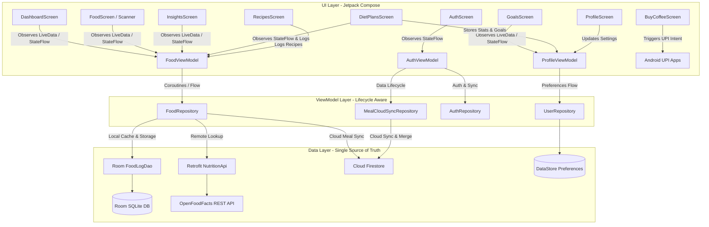

# Nutritrack 🥗
### Intelligent Macro Tracker, Calorie Counter & Nutrition Planner for Android

[](https://github.com/ritishchauhan/NutriTrack/releases)
[](https://kotlinlang.org)
[](https://developer.android.com/jetpack/compose)
[](https://m3.material.io)
[](https://developer.android.com/topic/architecture)
[](https://firebase.google.com/docs/firestore)
[](https://developers.google.com/ml-kit)
[](https://developer.android.com/training/data-storage/room)
[](https://firebase.google.com/)
[](LICENSE)

**Nutritrack** is a modern, high-performance Android nutrition and macro tracking application engineered with 100% **Jetpack Compose**, **Material 3**, and strict **MVVM (Model-View-ViewModel)** architecture. It empowers users to monitor their calories, protein, carbohydrates, fats, and fiber with intelligent tools including **Camera Barcode Scanning (ML Kit)**, **OpenFoodFacts Integration**, **Smart "My Meals" with Automatic Dish Detection & Ingredient Composite Calculator**, **Interactive Weight Trend & 3-Month Predictive Forecasting**, **Personalized Indian Diet Plans**, **100+ Authentic Indian Recipes**, and **Seamless Multi-Device Cloud Synchronization powered by Firebase Cloud Firestore and Room SQLite Local-First**.

---

## 📱 Key Features

### 1. 📊 Interactive Dashboard & Health Cockpit
- **Real-Time Calorie Breakdown:** Circular progress rings visualizing calories consumed vs. remaining daily budget.
- **Macronutrient Gauges:** Dynamic progress indicators for Protein, Carbohydrates, Healthy Fats, and Dietary Fiber.
- **Hydration Tracker:** Visual water intake tracker with quick-add volume adjustments (`+250ml`, `+500ml`).
- **Contextual Greetings & Streaks:** Time-aware greetings (morning, afternoon, evening, night) and continuous streak counter.
- **Quick Date Navigation:** Effortlessly switch between days to review previous nutritional logs.

### 2. 📷 Real Camera Barcode Scanner (ML Kit + CameraX)
- **High-Speed Hardware Scanner:** Native CameraX viewfinder powered by Google ML Kit Barcode Scanning with continuous autofocus and torch toggle.
- **Broad Code Support:** Scans UPC-A, UPC-E, EAN-13, EAN-8, QR Code, Code 128, and Code 39.
- **Instant Nutrition Lookup:** Direct integration with the OpenFoodFacts API to auto-fetch food identity, brand, thumbnail, and nutrient facts.
- **Nutritional Review Modal:**
  - Displays high-resolution food image, brand, and verified barcode.
  - Interactive portion multiplier (`0.5x`, `1.0x`, `1.5x`, `2.0x`) with real-time macro recalculation.
  - Meal categorization (`Breakfast`, `Lunch`, `Dinner`, `Snack`).
  - Dedicated action buttons: **"Add to Daily Meals"** (commits to local Room DB and syncs with cloud) and **"Discard"** (closes without saving).
- **Test Mode & Manual Fallback:** Quick-test chips and manual barcode entry for instant testing without physical packages.

### 3. 🍽️ Smart "My Meals" & Intelligent Dish Nutrition Calculator
- **Automated Dish Recognition (`DishDatabase`):** Type popular dishes (e.g. *Dal Tadka*, *Paneer Bhurji*, *Roti*, *Biryani*, *Poha*, *Khichdi*) and Nutritrack automatically calculates exact calories and macros based on portion weight in grams.
- **Custom Ingredient Composite Calculator:** For unique or complex home-cooked meals, add individual ingredients (e.g. Oats, Milk, Peanut Butter, Chia Seeds) with portion weights; Nutritrack computes cumulative composite nutrition automatically.
- **OpenFoodFacts Global Search:** Live search across hundreds of thousands of branded and generic foods with instant 1-tap logging.
- **Smart Filtering:** Categorize and inspect meals by Breakfast, Lunch, Dinner, and Snacks.
- **Serving Adjustments:** Real-time serving size increment/decrement controls with automatic macro scaling.
- **Log Management:** Swipe-to-delete and full meal history management with real-time cloud sync.

### 4. 📈 Weight Trend Analysis & 3-Month Predictive Forecasting
- **Smoothed Exponential Moving Average (EMA):** Eliminates deceptive day-to-day water weight fluctuations to reveal true metabolic progress.
- **Interactive Canvas Historical Chart:** Smooth visual trajectory with zero-allocation rendering for 60fps/120fps responsiveness.
- **Morning Weigh-in Logger:** Quick morning weigh-in logging with daily delta and streak tracking.
- **Contextual Improvement Suggestions:** Real-time algorithmic advice based on current rate of change vs. fitness goal (e.g., healthy deficit maintenance, plateau warnings, surplus guidance).
- **3-Month Goal-Driven Forecast:** Visual 3-month projection curve tailored for **Fat Loss** or **Muscle Gain** with customizable weekly pace (0.25 kg to 1.0 kg/week) and milestone targets.

### 5. 💾 Local-First Architecture & OS Uninstall Data Retention
- **Offline Cache & Room Storage:** 100% of user meal logs, daily macros, water tracking, streaks, and personal targets are cached locally on-device using Android Room (SQLite) and Jetpack DataStore for instant, zero-latency UI access.
- **Data Security:** All tracked nutrition and health data is securely linked to the user's authenticated account and synced with Cloud Firestore.
- **OS Uninstall Data Retention (`android:hasFragileUserData`):** When uninstalling or deleting the application from the device, the Android OS automatically prompts the user whether to keep or wipe their locally stored data, preventing accidental loss of nutritional history.

### 6. ☁️ Multi-Device Cloud Sync (Firebase Cloud Firestore)
- **Automatic Meal Sync:** Every logged meal is automatically synced and stored in **Cloud Firestore** under the authenticated user's ID document structure (`users/{userId}/tracked_meals/{mealId}`).
- **Cross-Device & Account Switch Continuity:** Logging into an account on any new device or switching accounts automatically pulls full meal history and profile targets from Cloud Firestore, merging and restoring all macros and goals seamlessly.
- **Resilient Offline-First Architecture:**
  - Local SQLite (Room) acts as the Single Source of Truth for the UI, ensuring 60fps responsiveness with zero network bottlenecks.
  - Cloud Firestore listeners sync background changes whenever network connectivity is active.
  - Granular document-level security rules enforce that users only access their own data.

### 7. 🥗 Personalized Indian Diet Plans & Real-Time BMI
- **Dynamic BMI Calculator:** Input Weight (kg) and Height (cm) to calculate real-time BMI with colored category badges (Underweight, Normal, Overweight, Obese) and personalized health targets.
- **Full-Day Meal Plans Matching User Goals:** Generates breakfast, lunch, snack, and dinner meal suggestions precisely calibrated to fulfill the user's exact daily caloric and protein targets (e.g. 150g protein goal).
- **Goal-Driven Plans:** Tailored for **Lose Weight (Fat Loss)**, **Gain Muscle (Lean Bulk)**, and **Gain Weight (Healthy Bulk)**.
- **Pure Veg & Non-Veg Plans:** Authentic Indian kitchen home-cooking meal plans with minimal oil (Palak Paneer, Moong Chilla, Dal Tadka, Soya Curry, Chicken Tikka, Egg Bhurji, etc.).
- **Interactive Recipe Modals:** Clickable "How to Make (Recipe)" button below each meal showing prep time, exact Indian kitchen ingredients, step-by-step cooking instructions, and an instant **"Add to Today's Meals"** action.

### 8. 📖 100+ Indian Home-Cooking Recipes Section
- **Extensive Culinary Catalog:** 105+ authentic Indian home recipes with complete macros (Calories, Protein, Carbs, Fats, Fiber).
- **Multi-Filter System:** Filter by All, Veg, Non-Veg, High-Protein, Breakfast, Lunch & Dinner, and Healthy Snacks & Smoothies.
- **Full-Text Recipe Search:** Search instantly across recipe titles, ingredients (e.g. paneer, chicken, dal, oats, egg), and fitness tags.

### 9. 🎯 Smart Goals & TDEE / Macro Calculator
- **Custom Goal Setting:** Personalize calorie targets and macro distribution ratios.
- **Biometric Calculations:** Automatic BMR and TDEE estimation based on age, gender, height, weight, and activity level.
- **Insights & Analytics:** 7-day and 30-day rolling averages with zero-state safety (no skewed averages for newly installed apps).

### 10. ⚡ High-Performance Optimization (Low-End to 120Hz Devices)
- **Jetpack Compose Model Stability:** Domain models annotated with `@Immutable` to allow Compose to skip recomposition on unchanged cards during scrolling.
- **Zero-Allocation Canvas Drawing:** Pre-computed path effects and single-pass min/max coordinates prevent GC pauses on low-memory devices.
- **Hardware Acceleration & Large Heap:** Configured with `hardwareAccelerated="true"` and `largeHeap="true"` for maximum RenderThread throughput and GPU rasterization.

### 11. 🔐 Authentication First (Sign Up / Sign In Required)
- **Account Mandatory:** Users create an account or sign in before accessing the dashboard and features, ensuring all nutrition and macro data is securely preserved.
- **Google Sign-In & Email/Password:** Fast one-tap Google Sign-In or secure Email & Password registration via Firebase Authentication.
- **Clean Input Fields:** Specially styled high-contrast text fields with clear hints and password visibility toggles.
- **Streamlined Settings:** Minimalist profile settings for user name, dietary preference, and activity level without UI clutter.

### 12. ☕ Support the Developer ("Buy Dev a Coffee")
- Accessible via the navigation drawer.
- Single-tap Android UPI Intent integration (`ritishchauhan.in@oksbi`) supporting Google Pay, PhonePe, Paytm, BHIM, and any installed UPI banking app.

### 13. 🎨 Justified Modern Bottom Navigation
- **Balanced Distance:** Custom `Surface` navigation bar using `Modifier.weight(1f)` for mathematically identical, justified spacing between all 4 tabs (`Home`, `My Meals`, `Insights`, `Goals`).
- **Micro-Animations:** Translucent emerald capsule indicators with bouncy spring scale feedback on tab selection.
- **Edge-to-Edge:** Native `WindowInsets.navigationBars` support.

---

## ☁️ Firebase Cloud Firestore Backend Architecture

Nutritrack uses **Firebase Cloud Firestore** as its primary cloud synchronization engine alongside **Room SQLite** for offline-first caching.

### Cloud Data Collections

#### 1. `users/{userId}/tracked_meals/{mealId}` Document
Stores all user meal logs for cloud persistence and multi-device synchronization:

```json
{
  "id": "meal_123456",
  "userId": "firebase_uid_string",
  "foodName": "Paneer Bhurji",
  "calories": 280.0,
  "protein": 18.5,
  "carbs": 6.2,
  "fat": 20.1,
  "fiber": 2.4,
  "portionMultiplier": 1.0,
  "mealType": "Breakfast",
  "barcode": "",
  "imageUrl": "",
  "loggedAt": 1727800000000,
  "details": ""
}
```

#### 2. `users/{userId}` Profile Document
Stores user nutritional targets, biometric stats, and account preferences:

```json
{
  "name": "User Name",
  "email": "user@example.com",
  "calorieGoal": 2000,
  "proteinGoal": 150,
  "carbsGoal": 200,
  "fatGoal": 65,
  "fiberGoal": 25,
  "waterGoal": 2.5,
  "waterLogged": 1.25,
  "streakDays": 5,
  "userWeightKg": 70.0,
  "userHeightCm": 170.0,
  "userFitnessGoal": "LOSE_WEIGHT",
  "dietaryPreference": "Non-veg",
  "activityLevel": "Sedentary",
  "updatedAt": 1727800000000
}
```

---

## 🔒 Strict Account Data Ownership & Backend Rules

Nutritrack enforces **Account-Based Data Ownership**: **The account owns the data, not the device.**

```
                       ┌────────────────────────────┐
                       │    Sign Up or Sign In      │
                       │  Google or Email/Password  │
                       └──────────────┬─────────────┘
                                      │
                      ┌───────────────┴───────────────┐
                      ▼                               ▼
        ┌───────────────────────────┐   ┌───────────────────────────┐
        │     New User Sign-Up      │   │   Existing User Sign-In   │
        │ • Isolated DataStore file │   │ • Isolated DataStore file │
        │ • Assigned to unique UID  │   │ • Cloud meals & targets   │
        │ • Synced to Cloud DB      │   │   restored for this UID   │
        └─────────────┬─────────────┘   └─────────────┬─────────────┘
                      │                               │
                      └───────────────┬───────────────┘
                                      ▼
                       ┌────────────────────────────┐
                       │    Active Signed-In User   │
                       │ • Room DB filtered by UID  │
                       │ • DataStore per UID        │
                       │ • Synced to Cloud DB       │
                       └──────────────┬─────────────┘
                                      │
                      ┌───────────────┴───────────────┐
                      ▼                               ▼
        ┌───────────────────────────┐   ┌───────────────────────────┐
        │       User Sign-Out       │   │     Delete Account        │
        │ • Memory session wiped    │   │ • Cloud meals deleted     │
        │ • Room/DataStore inactive │   │ • Profile data purged     │
        │ • SERVER DATA PRESERVED   │   │ • Local cache removed     │
        │ • No data leak to next user│   │ • Auth account deleted    │
        └───────────────────────────┘   └───────────────────────────┘
```

### Core Architecture & Isolation Rules

1. **Unique User ID Linkage:** Every single meal, macro calculation, water entry, goal, weight, height, and preference is strictly tied to the authenticated `User ID` (`UID`). No data is ever linked solely to device identifiers.
2. **Account Data Separation:** Each account maintains completely separate data partitions across all layers:
   - **Local Database (Room SQLite):** `FoodLogEntity` stores `userId`. All DAO queries enforce `WHERE userId = :userId`.
   - **Local Preferences (Jetpack DataStore):** Dynamic isolated files (`user_profile_{userId}.preferences_pb`) ensure goals, settings, and biometric stats never cross accounts.
   - **Cloud Firestore:** Security rules enforce strict document-level ownership (`request.auth.uid == userId`).
3. **Server Data Preservation on Sign-Out:** When a user logs out, their server data is **never deleted**. All cloud records remain safe for future logins or device switches.
4. **Immediate Active Session Clearing:** Upon sign-out, all in-memory ViewModel states (`FoodViewModel`, `ProfileViewModel`, `AuthViewModel`) and reactive flows are immediately reset to default/empty values.
5. **No Cross-User Leaks on Account Switching:** When a different account logs in on the same device, only that account's data is loaded and displayed. The previous user's data never appears.
6. **Isolated Offline Data Sync:** User A's pending offline data is tagged with User A's `UID` and is **never** synced to User B's account.
7. **Sign-Out vs Account Deletion Separation:**
   - **Sign-Out:** Closes session, resets memory, preserves server records.
   - **Delete Account:** Separate danger-zone operation with confirmation that permanently purges all cloud records from Cloud Firestore, clears local database caches, and deletes the authentication record.
8. **Auth Failure Protection:** If sign-in fails, the app remains in the unauthenticated state, guaranteeing no private data from previous sessions is accessible.
9. **Automatic ID Assignment:** All newly created meals, macros, and profile updates automatically inherit the verified authenticated User ID. Manual tampering or altering User IDs is rejected by backend security boundaries.

---

## 🏛️ MVVM Architecture & Design Pattern

Nutritrack strictly adheres to official **Android Architecture Guidelines** and **Single Source of Truth (SSOT)** design principles:



---

## 🛠️ Technology Stack & Dependencies

| Component | Library / Framework | Version | Purpose |
|---|---|---|---|
| **Language** | Kotlin | `2.2.10` | Core modern programming language |
| **UI Framework** | Jetpack Compose (BOM) | `2024.09.00` | Declarative UI toolkit |
| **Design System** | Material 3 | `1.4.0` | Botanical Emerald & Dark Slate theme |
| **Navigation** | AndroidX Navigation 3 | `1.0.1` | Type-safe declarative app routing |
| **Local Database** | AndroidX Room | `2.7.0` | SQLite database for local-first meal logging |
| **Cloud Database** | Firebase Cloud Firestore | `25.1.2` | Real-time multi-device cloud data synchronization |
| **Preferences** | AndroidX DataStore | `1.1.7` | Persistent key-value user settings & targets |
| **Camera Feed** | AndroidX CameraX | `1.5.0` | Hardware camera preview & frame capture |
| **Barcode Scanner**| Google ML Kit Barcode | `17.3.0` | On-device package barcode detection |
| **Networking** | Retrofit 2 + OkHttp 3 | `2.12.0` | REST API communication for food search |
| **Serialization**| Moshi + Kotlin Reflection | `1.15.2` | Fast JSON serialization |
| **Image Loading** | Coil Compose | `2.7.0` | Food product image caching |
| **Authentication**| Firebase Auth | `33.9.0` | Google Sign-in & Email authentication |

---

## 📂 Project Structure

```
macro_tracker/
├── app/
│   ├── src/
│   │   ├── main/
│   │   │   ├── AndroidManifest.xml          # Permissions & android:hasFragileUserData="true"
│   │   │   ├── java/com/example/macro_tracker/
│   │   │   │   ├── data/
│   │   │   │   │   ├── local/               # Room Entity, DAO, DietPlansData, RecipesData
│   │   │   │   │   │   ├── AppDatabase.kt
│   │   │   │   │   │   ├── FoodLogDao.kt
│   │   │   │   │   │   ├── FoodLogEntity.kt
│   │   │   │   │   │   ├── DietPlansData.kt
│   │   │   │   │   │   ├── RecipesData.kt
│   │   │   │   │   │   └── UserProfileManager.kt
│   │   │   │   │   ├── remote/              # Retrofit & OpenFoodFacts API
│   │   │   │   │   │   ├── NutritionApi.kt
│   │   │   │   │   │   └── NutritionApiClient.kt
│   │   │   │   │   └── repository/          # Repository Implementations
│   │   │   │   │       ├── AuthRepository.kt
│   │   │   │   │       ├── FoodRepository.kt
│   │   │   │   │       ├── MealCloudSyncRepository.kt
│   │   │   │   │       └── UserRepository.kt
│   │   │   │   ├── di/
│   │   │   │   │   └── AppContainer.kt      # Manual Dependency Injection Container
│   │   │   │   ├── ui/                      # Jetpack Compose UI Screens & ViewModels
│   │   │   │   │   ├── theme/               # Color, Typography, and Theme Tokens
│   │   │   │   │   ├── AppNavigation.kt     # Bottom Navigation & Drawer Menu
│   │   │   │   │   ├── AuthScreen.kt        # Email & Google Sign-In
│   │   │   │   │   ├── AuthViewModel.kt
│   │   │   │   │   ├── BarcodeScannerView.kt # CameraX + ML Kit Viewfinder & Modals
│   │   │   │   │   ├── BuyCoffeeScreen.kt   # Developer Support via UPI
│   │   │   │   │   ├── DashboardScreen.kt   # Cockpit & Macro Rings
│   │   │   │   │   ├── DietPlansScreen.kt   # Personalized Indian Diet Plans
│   │   │   │   │   ├── FoodScreen.kt        # Meal Log & Search
│   │   │   │   │   ├── FoodViewModel.kt
│   │   │   │   │   ├── GoalsScreen.kt       # Target & TDEE Configuration
│   │   │   │   │   ├── InsightsScreen.kt    # Trends & Rolling Averages
│   │   │   │   │   ├── ProfileScreen.kt     # Profile & Settings Dialog
│   │   │   │   │   ├── ProfileViewModel.kt
│   │   │   │   │   ├── RecipeDetailModal.kt # Step-by-Step Cooking Modal
│   │   │   │   │   ├── RecipesScreen.kt     # 100+ Indian Recipes
│   │   │   │   │   ├── WeightTrendScreen.kt # Weight Trend & 3-Month Forecast
│   │   │   │   │   ├── MainActivity.kt      # Single Activity Entrypoint
│   │   │   │   │   └── MacroTrackerApplication.kt
│   │   │   └── res/
│   │   │       ├── font/                    # Outfit custom typography (TTF)
│   │   │       ├── drawable/                # App icon and vector assets
│   │   │       └── values/                  # Strings, colors, and XML themes
│   │   └── build.gradle.kts
│   └── google-services.json                 # Firebase configuration
├── gradle/
│   └── libs.versions.toml                   # Centralized Version Catalog
├── build.gradle.kts
└── settings.gradle.kts
```

---

## 🚀 Getting Started & How to Run

### Prerequisites
- **Android Studio:** Ladybug (2024.2.1) or Meerkat / latest Canary.
- **JDK:** Java 17 or Java 21 (bundled JBR in Android Studio).
- **Android SDK:** Minimum SDK 29 (Android 10), Target SDK 37.
- **Physical Device or Emulator:** With camera support enabled for barcode scanning.

### Setup Instructions

1. **Clone the repository:**
   ```bash
   git clone https://github.com/ritishchauhan/NutriTrack.git
   cd NutriTrack
   ```

2. **Open in Android Studio:**
   - Launch Android Studio and choose **Open**, selecting the cloned folder.
   - Wait for Gradle sync to complete.

3. **Backend & Authentication Configuration:**
   - **Firebase:** Place your `google-services.json` inside the `app/` folder.
   - **Authentication:** Users must sign up or sign in (via Google or Email/Password) to start tracking. All meals and profile targets sync directly to your Firebase Cloud Firestore backend.

4. **Run Unit Tests:**
   ```bash
   ./gradlew testDebugUnitTest
   ```

5. **Build APK (when requested):**
   ```bash
   ./gradlew assembleDebug
   ```

---

## 🔒 Permissions Used

- `android.permission.CAMERA`: Used exclusively for the live camera viewfinder to scan food product barcodes.
- `android.permission.INTERNET`: Used to query OpenFoodFacts API, Firebase Cloud Firestore, and Firebase Authentication.

---

## 📄 Copyright & License

Copyright © 2026 **Ritish Chauhan**. All rights reserved.

This project is licensed under the [MIT License](LICENSE) - you are free to use, modify, and distribute this software in accordance with the terms of the license.

---

*Crafted with passion for healthy living, modern Android development, and clean code.*
